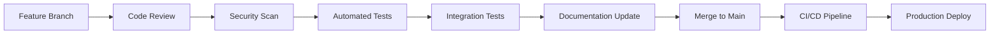

# 📚 Bakery Flow Manager Documentation

## Overview

Welcome to the **Bakery Flow Manager** documentation hub. This system is a comprehensive workflow management solution designed specifically for bakery operations, featuring user authentication, role-based access control, and process management.

## 🏗️ System Architecture

```
┌─────────────────────────────────────────────────────────┐
│                 🎮 Presentation Layer                  │
│              (REST APIs + Web Interface)               │
├─────────────────────────────────────────────────────────┤
│                 🎯 Business Logic Layer                │
│            (Services + Use Cases)                      │
├─────────────────────────────────────────────────────────┤
│                 🗄️ Data Access Layer                   │
│            (Repositories + JPA Entities)               │
├─────────────────────────────────────────────────────────┤
│                 🏛️ Domain Models Layer                 │
│              (Core Business Entities)                  │
└─────────────────────────────────────────────────────────┘

🔐 Security Layer (JWT Authentication + RBAC)
📊 Database Layer (PostgreSQL + H2 for testing)
⚙️ Configuration Layer (Spring Boot Properties)
```

## 📋 Documentation Sections

### 🗄️ [Database Schema](./database/schema.md)
- Entity Relationship Diagrams
- Table definitions and constraints
- Data flow diagrams
- Performance optimization guidelines
- Migration strategies

### 🔐 [Security Configuration](./security/README.md)
- JWT Authentication implementation
- Role-based access control (RBAC)
- Security best practices
- API authentication flows

### 🎮 [API Documentation](./api/README.md)
- REST API endpoints
- Request/Response formats
- Authentication requirements
- Error handling
- Rate limiting and throttling

### 🚀 [Deployment Guide](./deployment/README.md)
- Environment setup
- Configuration management
- Docker containerization
- Production deployment
- Monitoring and logging

### 🛠️ [Development Setup](./development/README.md)
- Local development environment
- Code structure and conventions
- Testing strategies
- Contributing guidelines

## 🔍 Quick Navigation

### For Developers
- [Getting Started](./development/README.md#getting-started)
- [Database Schema](./database/schema.md#overview)
- [API Reference](./api/README.md#authentication)
- [Security Implementation](./security/README.md#jwt-implementation)

### For System Administrators
- [Deployment Guide](./deployment/README.md#production-setup)
- [Configuration](./deployment/README.md#environment-variables)
- [Monitoring](./deployment/README.md#monitoring)
- [Backup Strategy](./database/schema.md#backup-strategy)

### For Business Users
- [User Roles and Permissions](./security/README.md#role-definitions)
- [Feature Overview](./api/README.md#features)
- [Workflow Management](./api/README.md#workflows)

## 🎯 Key Features

### 🔐 Authentication & Authorization
- **JWT-based Authentication** with access and refresh tokens
- **Role-based Access Control** (RBAC) with 5 predefined roles
- **Multi-factor Authentication** support (planned)
- **Session Management** with configurable timeouts

### 👥 User Management
- **User Registration** with email verification
- **Profile Management** with customizable fields
- **Employee ID Integration** with existing systems
- **Audit Logging** for all user actions

### 📊 Workflow Management
- **Production Workflows** for bakery operations
- **Inventory Management** integration
- **Order Processing** automation
- **Reporting and Analytics** dashboard

### 🛡️ Security Features
- **Password Encryption** using BCrypt
- **CORS Configuration** for web applications
- **Rate Limiting** to prevent abuse
- **Security Headers** for modern browsers

## 🏗️ Technology Stack

### Backend
- **Spring Boot 3.x** - Application framework
- **Spring Security 6.x** - Security framework
- **Spring Data JPA** - Database abstraction
- **JWT (JSON Web Tokens)** - Stateless authentication
- **PostgreSQL** - Primary database
- **H2 Database** - Development/testing

### Development Tools
- **Maven** - Dependency management
- **Lombok** - Code generation
- **MapStruct** - Object mapping
- **OpenAPI/Swagger** - API documentation
- **GitGuardian** - Security scanning

### Testing
- **JUnit 5** - Unit testing
- **Mockito** - Mocking framework
- **TestContainers** - Integration testing
- **Spring Boot Test** - Application testing

## 🔄 Development Workflow



## 📊 System Metrics

### Performance Targets
- **API Response Time**: < 200ms (95th percentile)
- **Database Query Time**: < 50ms average
- **Authentication Latency**: < 100ms
- **System Uptime**: 99.9% availability

### Scalability
- **Concurrent Users**: 1,000+ active sessions
- **Database Connections**: 20-100 connection pool
- **Memory Usage**: < 512MB heap size
- **CPU Utilization**: < 70% average

## 🚨 Security Posture

### Compliance
- **OWASP Top 10** mitigation
- **GDPR** data protection compliance
- **SOC 2** Type II certification (planned)
- **ISO 27001** information security (planned)

### Security Measures
- **Encryption at Rest** and in transit
- **Regular Security Audits** and penetration testing
- **Vulnerability Scanning** with automated tools
- **Security Incident Response** procedures

## 📞 Support and Contact

### Technical Support
- **Documentation Issues**: Create GitHub issue
- **Bug Reports**: Use issue templates
- **Feature Requests**: Submit enhancement proposals
- **Security Issues**: Follow responsible disclosure

### Team Contacts
- **Development Team**: dev-team@bakery.com
- **System Administrator**: sysadmin@bakery.com
- **Security Team**: security@bakery.com
- **Product Manager**: product@bakery.com

## 📈 Roadmap

### Version 1.1 (Q1 2024)
- [ ] Multi-factor Authentication
- [ ] Advanced Reporting Dashboard
- [ ] Mobile API optimization
- [ ] Performance monitoring integration

### Version 1.2 (Q2 2024)
- [ ] Workflow Automation Engine
- [ ] Third-party integrations
- [ ] Advanced audit logging
- [ ] Data export/import features

### Version 2.0 (Q3 2024)
- [ ] Microservices architecture
- [ ] Real-time notifications
- [ ] Machine learning recommendations
- [ ] Advanced analytics

## 📄 License

This project is licensed under the **MIT License** - see the [LICENSE](../LICENSE) file for details.

## 🙏 Acknowledgments

- **Spring Team** for excellent framework
- **PostgreSQL Community** for robust database
- **Open Source Contributors** for valuable tools
- **Security Researchers** for vulnerability disclosures

---

## 🔗 Quick Links

| Section | Description | Link |
|---------|-------------|------|
| **Database** | Schema and data modeling | [📊 Schema](./database/schema.md) |
| **API** | REST endpoints and usage | [🎮 API Docs](./api/README.md) |
| **Security** | Authentication and authorization | [🔐 Security](./security/README.md) |
| **Deployment** | Production setup and configuration | [🚀 Deploy](./deployment/README.md) |
| **Development** | Local setup and contribution | [🛠️ Dev Guide](./development/README.md) |

---

**Last Updated**: 2024-01-XX  
**Version**: 1.0.0  
**Documentation Version**: 1.0

---

*This documentation is maintained by the Bakery Flow Manager development team. For the most up-to-date information, always refer to the main repository.*

📧 **Questions or Feedback?** Contact us at docs@bakery.com