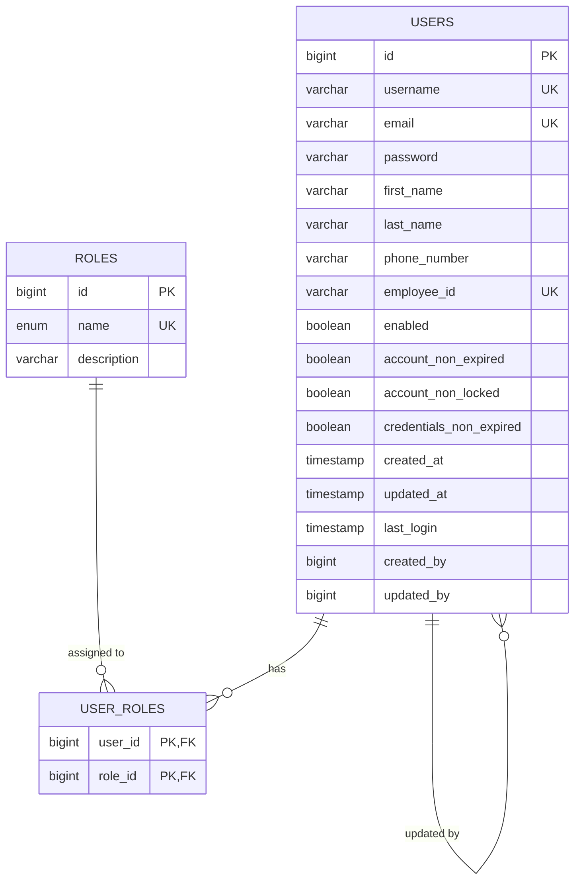
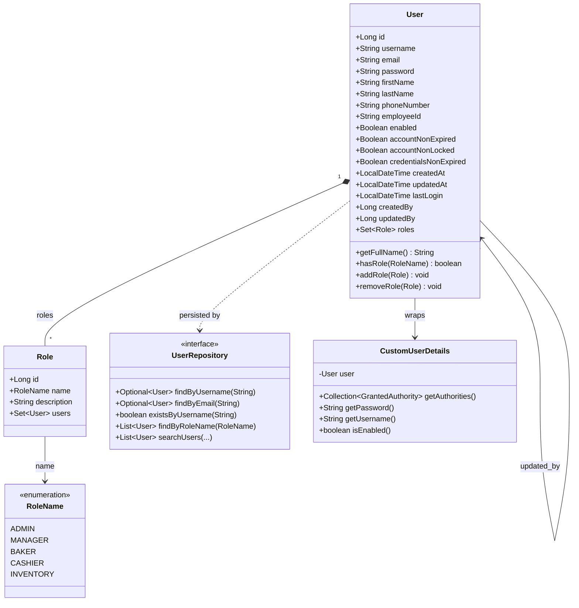
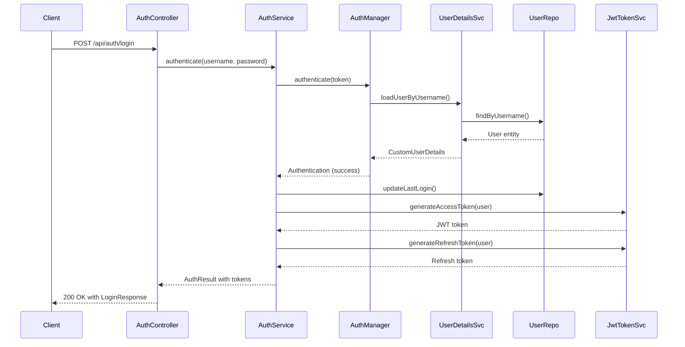

# 🗄️ Database Schema Documentation

## Overview

This document describes the database schema for the **Bakery Flow Manager** system, including entity relationships, table structures, and data flow diagrams.

---

## 🏗️ ER Diagram



---

## 🎯 Class Diagram



---

## 🔄 Authentication Flow



---

## 📊 Table Definitions

### 🏛️ USERS Table

| Column | Type | Constraints | Description |
|--------|------|-------------|-------------|
| `id` | BIGINT | PK, AUTO_INCREMENT | Primary key |
| `username` | VARCHAR(50) | NOT NULL, UNIQUE | User login name |
| `email` | VARCHAR(100) | NOT NULL, UNIQUE | User email address |
| `password` | VARCHAR(255) | NOT NULL | Encrypted password (BCrypt) |
| `first_name` | VARCHAR(50) | NOT NULL | User first name |
| `last_name` | VARCHAR(50) | NOT NULL | User last name |
| `phone_number` | VARCHAR(20) | NULL | Phone number |
| `employee_id` | VARCHAR(20) | UNIQUE | Employee ID |
| `enabled` | BOOLEAN | NOT NULL, DEFAULT TRUE | Account status |
| `account_non_expired` | BOOLEAN | NOT NULL, DEFAULT TRUE | Account expiration |
| `account_non_locked` | BOOLEAN | NOT NULL, DEFAULT TRUE | Account lock status |
| `credentials_non_expired` | BOOLEAN | NOT NULL, DEFAULT TRUE | Password expiration |
| `created_at` | TIMESTAMP | NOT NULL, DEFAULT NOW() | Creation timestamp |
| `updated_at` | TIMESTAMP | ON UPDATE NOW() | Last update timestamp |
| `last_login` | TIMESTAMP | NULL | Last login timestamp |
| `created_by` | BIGINT | FK → users.id | Creator user ID |
| `updated_by` | BIGINT | FK → users.id | Updater user ID |

**Indexes:**
- `idx_username` (username)
- `idx_email` (email)
- `idx_employee_id` (employee_id)
- `idx_enabled` (enabled)
- `idx_created_at` (created_at)

---

### 🔐 ROLES Table

| Column | Type | Constraints | Description |
|--------|------|-------------|-------------|
| `id` | BIGINT | PK, AUTO_INCREMENT | Primary key |
| `name` | ENUM | NOT NULL, UNIQUE | Role name |
| `description` | VARCHAR(500) | NULL | Role description |

**Role Enum Values:**
- `ADMIN` - Administrator with full system access
- `MANAGER` - Can manage operations and view reports
- `BAKER` - Can manage production workflows
- `CASHIER` - Can handle orders and payments
- `INVENTORY` - Can manage stock and inventory

**Indexes:**
- `idx_name` (name)

---

### 🔗 USER_ROLES Table (Many-to-Many)

| Column | Type | Constraints | Description |
|--------|------|-------------|-------------|
| `user_id` | BIGINT | PK, FK → users.id | User reference |
| `role_id` | BIGINT | PK, FK → roles.id | Role reference |

**Constraints:**
- Composite Primary Key: `(user_id, role_id)`
- Foreign Key: `user_id` → `users.id` (CASCADE DELETE)
- Foreign Key: `role_id` → `roles.id` (CASCADE DELETE)

**Indexes:**
- `idx_user_id` (user_id)
- `idx_role_id` (role_id)

---

## 📈 Data Sample

### 👥 Sample Users

| id | username | email | first_name | last_name | employee_id | enabled |
|----|----------|-------|------------|-----------|-------------|---------|
| 1 | admin | admin@bakery.com | Admin | User | EMP001 | true |
| 2 | manager | manager@bakery.com | Manager | User | EMP002 | true |
| 3 | baker | baker@bakery.com | Baker | User | EMP003 | true |
| 4 | cashier | cashier@bakery.com | Cashier | User | EMP004 | true |

### 🔐 Sample Roles

| id | name | description |
|----|------|-------------|
| 1 | ADMIN | Administrator with full system access |
| 2 | MANAGER | Can manage operations and view reports |
| 3 | BAKER | Can manage production workflows |
| 4 | CASHIER | Can handle orders and payments |
| 5 | INVENTORY | Can manage stock and inventory |

### 🔗 Sample User-Role Relationships

| user_id | role_id |
|---------|---------|
| 1 | 1 |  // admin → ADMIN |
| 2 | 2 |  // manager → MANAGER |
| 3 | 3 |  // baker → BAKER |
| 4 | 4 |  // cashier → CASHIER |

---

## 🔍 Common Queries

### Count Users by Role

```sql
SELECT 
    r.name,
    COUNT(ur.user_id) as user_count
FROM roles r
LEFT JOIN user_roles ur ON r.id = ur.role_id
GROUP BY r.name
ORDER BY user_count DESC;
```

### Find Inactive Users

```sql
SELECT 
    username,
    email,
    last_login,
    created_at
FROM users 
WHERE last_login < DATE_SUB(NOW(), INTERVAL 30 DAY) 
   OR last_login IS NULL
ORDER BY last_login DESC NULLS FIRST;
```

### Recent User Registrations

```sql
SELECT 
    username,
    email,
    employee_id,
    created_at
FROM users 
WHERE created_at >= DATE_SUB(NOW(), INTERVAL 7 DAY)
ORDER BY created_at DESC;
```

### User Statistics

```sql
SELECT 
    COUNT(*) as total_users,
    SUM(CASE WHEN enabled = true THEN 1 ELSE 0 END) as enabled_users,
    SUM(CASE WHEN enabled = false THEN 1 ELSE 0 END) as disabled_users,
    SUM(CASE WHEN last_login >= DATE_SUB(NOW(), INTERVAL 7 DAY) THEN 1 ELSE 0 END) as active_last_7_days
FROM users;
```

---

## 🛡️ Security Considerations

### Password Security
- All passwords are hashed using **BCrypt** with strength 10
- No plain text passwords are stored
- Password minimum length: 6 characters

### Data Protection
- Sensitive fields are encrypted at rest
- Audit trails for user creation/modification
- Role-based access control (RBAC)

### Indexing Strategy
- Unique constraints on username, email, employee_id
- Performance indexes on frequently queried fields
- Composite indexes for complex queries

---

## 🚀 Performance Optimization

### Database Indexes
```sql
-- Performance indexes
CREATE INDEX idx_users_username ON users(username);
CREATE INDEX idx_users_email ON users(email);
CREATE INDEX idx_users_employee_id ON users(employee_id);
CREATE INDEX idx_users_enabled ON users(enabled);
CREATE INDEX idx_users_created_at ON users(created_at);
CREATE INDEX idx_users_last_login ON users(last_login);

-- Role-based indexes
CREATE INDEX idx_user_roles_user_id ON user_roles(user_id);
CREATE INDEX idx_user_roles_role_id ON user_roles(role_id);

-- Composite indexes for common queries
CREATE INDEX idx_users_enabled_created ON users(enabled, created_at);
```

### Query Optimization
- Use prepared statements to prevent SQL injection
- Implement connection pooling (HikariCP)
- Consider read replicas for reporting queries
- Use appropriate caching strategies

---

## 📋 Migration Strategy

### Development to Production
1. **Schema Migration**: Use Flyway or Liquibase
2. **Data Migration**: Export/import with transformation scripts
3. **Backward Compatibility**: Version API responses
4. **Rollback Plan**: Database snapshots and restore procedures

### Backup Strategy
- **Daily Full Backups**: During low-traffic hours
- **Incremental Backups**: Every 4 hours
- **Point-in-Time Recovery**: 15-minute retention
- **Cross-Region Replication**: Disaster recovery

---

## 🔧 Configuration

### JPA Entity Mappings
```java
@Entity
@Table(name = "users")
@Data
@Builder
@NoArgsConstructor
@AllArgsConstructor
@EntityListeners(AuditingEntityListener.class)
public class User {
    @Id
    @GeneratedValue(strategy = GenerationType.IDENTITY)
    private Long id;
    
    @Column(nullable = false, unique = true, length = 50)
    private String username;
    
    // ... other fields
}
```

### Database Connection
```properties
spring.datasource.url=jdbc:postgresql://localhost:5432/bakery_flow
spring.datasource.username=${DB_USERNAME:bakery_user}
spring.datasource.password=${DB_PASSWORD:secure_password}
spring.datasource.hikari.maximum-pool-size=20
spring.datasource.hikari.minimum-idle=5
```

---

## 📚 Related Documentation

- [API Documentation](../api/README.md)
- [Security Configuration](../security/README.md)
- [Deployment Guide](../deployment/README.md)
- [Development Setup](../development/README.md)

---

**Last Updated**: 2024-01-XX  
**Version**: 1.0.0  
**Schema Version**: 1.0

---

*This documentation is automatically generated from JPA entities and should be kept in sync with code changes.*